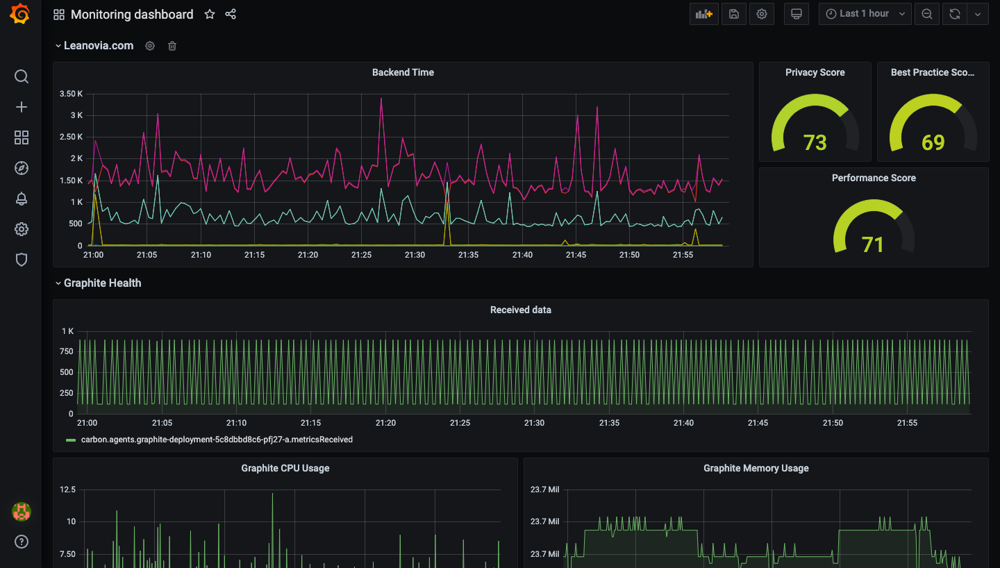

# Sitespeed Synthetic Monitor

This is a demo project :

This project use kubernetes to deploy a grafana/graphite stack. The Graphite database will be alimented by sitespeed.io performance tests results to monitor the performances of a website.

I use minikube as a kubernetes cluster.

## Scripts

* create-all.sh : create kubernetes configmaps,deployments and services for graphite and grafana.
* rm-all.sh : remove all kubernetes objects.
* update-all.sh : update all kubernetes objets.
* sitespeed/run-leanoviacom.sh : start an infinite loop which will send datas to the graphite instance deployed on minikube.
